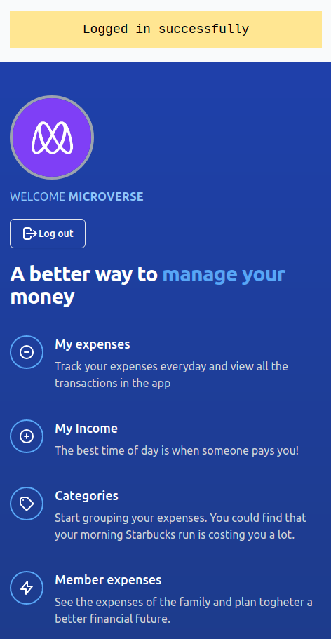

# Ruby on rails Capstone: Edx Wallet



# Live Demo

[Live demo](https://edx-wallet.herokuapp.com/)

# Ruby on Rails Capstone for Microverse, the design is responsive to be used on mobile or desktop.
## Features in this app:

- User can register with only username and an avatar picture (no password need).
- Only username is need to log in.
- Once sign in it will show: my expenses, my income, categories and members expenses.

## Sections
### My expenses sorted by most recent
- Details of expenses; group icon & name, date, description, amount by current user.
- Display total amount of expenses and income
- User can go to income details
- User can add a new expense
- User can edit each transaction
- User can delete a transaction

### My income sorted by most recent
- Details of income; group icon, date, description, amount by current user.
- Display total amount of expenses and income
- User can go to expenses details
- User can edit each transaction
- User can delete a transaction

### Categories sorted by alphabetical order
- All categories created display on screen
- Each category has: icon, name of category
- User can edit name and icon
- User can delete category
- When user clic on each category it will show all transactions associated to it


# How to run this project

- Install Ruby.
- Install Ruby on Rails.
- Install bundle.
- Run "bundle install" inside the folder.
- Run "yarn check files"
- Run "db:create"
- Run "rails db:migrate"
- Run "rails db:seed"
- Run "rails server" inside folder.
- Go to http://127.0.0.1:3000/


## Test-driven development RSPEC

The code includes unit testing using RSpec. 
To start the test run the next line in your terminal:

```
rspec spec --format documentation
```

## Author

👤 **Eduardo Baeza**

- GitHub: [@edxco](https://github.com/edxco/)
- Twitter: [@lalo_nbc](https://twitter.com/lalo_nbc/)
- LinkedIn: [eduardo-n-baeza](https://www.linkedin.com/in/eduardo-n-baeza/)

## Acknowledgments

- [Microverse](https://www.microverse.org/)
- [Web-Crunch](https://www.youtube.com/c/Webcrunch/playlists)


## 🤝 Contributing

Contributions, [issues](https://github.com/edxco/financial_app/issues) and feature requests are welcome! 

Start by:

Forking the project.
Cloning the project to your local machine.
cd into the project directory.
Run git checkout -b your-branch-name.
Make your contributions.
Push your branch up to your forked repository.
Open a Pull Request with a detailed description to the development branch of the original project for a review.